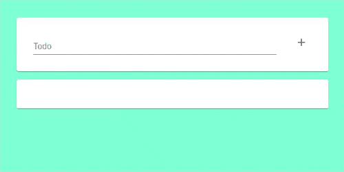
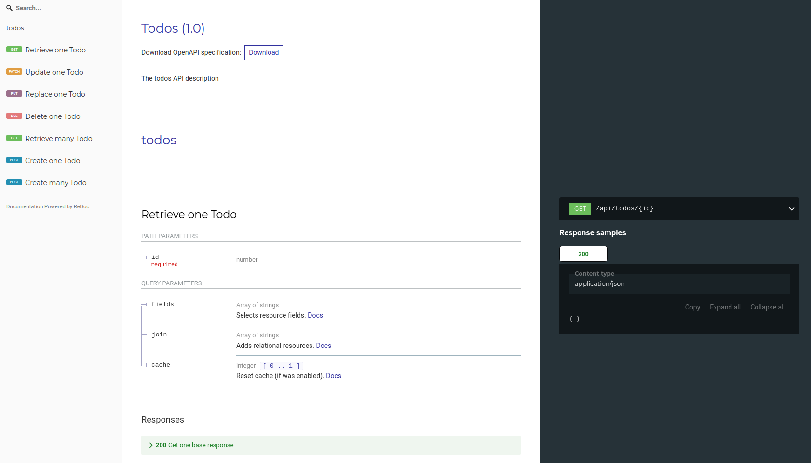

<div align="center">
  <h1>Stator</h1>
</div>
<div align="center">
  <strong>Stator, your go-to template for the perfect stack.</strong>
</div>
</br>

<div align="center">
  <a href="https://badge.fury.io/gh/chocolat-chaud-io%2Fstator">
    
  </a>
  <a href="https://github.com/chocolat-chaud-io/stator/actions">
    
  </a>
  <a href="https://coveralls.io/github/chocolat-chaud-io/stator?branch=master">
    
  </a>
  <a href="http://commitizen.github.io/cz-cli/">
    
  </a>
  <a href="https://renovatebot.com">
    
  </a>
  <a href="https://github.com/semantic-release/semantic-release">
    
  </a>
  <a href="https://github.com/nestjs/nest">
    
  </a>
  <a href="https://github.com/juliandavidmr/awesome-nestjs#resources">
    
  </a>
  <a href="https://opensource.org/licenses/MIT">
    
  </a>
  <a href="http://makeapullrequest.com">
    
  </a>
  <a href="https://github.com/chocolat-chaud-io/stator">
    
  </a>
</div>

</br>

## 🚀 Quick Start

The interactive CLI will guide you to easily setup your project.

```
npm run get-started
```

</br>

## 📋 Table of Contents

- [About the Project](#-about-the-project)
- [Demo Application](#-demo-application)
  - [Technical Stack](#technical-stack)
- [Getting Started](#-getting-started)
  - [Prerequisites](#prerequisites)
  - [Copy the template](#copy-the-template)
  - [Make it yours](#make-it-yours)
  - [Run the application](#run-the-application)
  - [Continuous Integration](#continuous-integration)
  - [Deployment](#deployment)
    - [Digital Ocean App Platform](#digital-ocean-app-platform)
    - [Kubernetes](#kubernetes)
- [Implementation](#%EF%B8%8F-implementation)
  - [Database](#database)
    - [Postgres](#postgres)
    - [Mongo](#mongo-not-recommended)
    - [Data seeding](#data-seeding)
  - [Backend](#backend)
  - [Frontend](#frontend)
  - [General](#global)

</br>

## 📚 About the Project

Have you ever started a new project by yourself?<br/>
If so, you probably know that it is tedious to set up all the necessary tools.<br/>
Just like you, the part I enjoy the most is coding, not boilerplate.

Say hi to stator, a full-stack [TypeScript](https://github.com/microsoft/TypeScript) template that enforces conventions, handles releases, automates deployments and much more!

If you want more details about how this idea was implemented, I recommend reading the [series of blog articles](https://yann510.hashnode.dev/creating-the-modern-developer-stack-template-part-1-ckfl56axy02e85ds18pa26a6z) I wrote on the topic.

</br>

## 🦄 [Demo Application](https://www.stator.dev)

This template includes a demo **todo application** that serves as an example of sound patterns.
Of course, you won't be creating a todo application for your project, but you can use this as an example of useful patterns and learn how to use the technologies presented in this project.



### Technical Stack

For a detailed list of all those technologies, you can read this [blog article](https://yann510.hashnode.dev/stator-a-full-stack-template-releases-deployments-enforced-conventions-ckhmnyhr903us9ms1b20lgi3b).

 | Deployment                                                                       | Database                                         | Backend                                                       | Frontend                                                      | Testing                                                                          | Conventions                                                                      |
 | -------------------------------------------------------------------------------- | ------------------------------------------------ | ------------------------------------------------------------- | ------------------------------------------------------------- | -------------------------------------------------------------------------------- | -------------------------------------------------------------------------------- |
 | [DigitalOcean App Platform](https://www.digitalocean.com/products/app-platform/) | [Postgres](https://github.com/postgres/postgres) | [Nest](https://github.com/nestjs/nest)                        | [React](https://github.com/facebook/react)                    | [jest](https://github.com/facebook/jest)                                         | [commitlint](https://github.com/conventional-changelog/commitlint)               |
 | [semantic-release](https://github.com/semantic-release/semantic-release)         | [Mongo](https://github.com/mongodb/mongo)        | [Fastify](https://github.com/fastify/fastify)                 | [React Router](https://github.com/ReactTraining/react-router) | [cypress](https://github.com/cypress-io/cypress)                                 | [eslint](https://github.com/eslint/eslint)                                       |
 |                                                                                  | [TypeORM](https://github.com/typeorm/typeorm)    | [Swagger](https://github.com/nestjs/swagger)                  | [Redux](https://github.com/reduxjs/redux)                     |                                                                                  | [prettier](https://github.com/prettier/prettier)                                 |
 |                                                                                  | [NestJs CRUD](https://github.com/nestjsx/crud)   | [ReDoc](https://github.com/Redocly/redoc)                     | [Redux Toolkit](https://github.com/reduxjs/redux-toolkit)     |                                                                                  |                                                                                  |
 |                                                                                  |                                                  |                                                               | [Material UI](https://github.com/mui-org/material-ui)         |                                                                                  |                                                                                  |

</br>

## 💥 Getting Started

### Prerequisites

- [Docker Compose](https://docs.docker.com/compose/install/)
- [node.js](https://nodejs.org/en/download/) v14.x

### Copy the template

This repository is a repository template, which means you can use the `Use this template` button at the top to create your project based on this.


\*Note: If you have an existing repository, this will require more work. I would recommend using the `use template button` and migrating your current code to the newly created projects.

### Make it yours

You will now want to make this project yours by replacing all organization and project naming occurrences with your own names.
Thankfully, we have a script just for that:

```
npm run rename-project -- --organization {YOUR_ORGANIZATION_NAME} --project {YOUR_PROJECT_NAME}
```

\*Note: I highly recommend that the project name is the same as your git repository.

The file will delete itself once it has been completed.
On completion, you will see the following message:


### Run the application

First, install the dependencies:

```
npm i
```

Then, run the whole stack:

```
npm run postgres
```

```
npm start api
```

```
npm start webapp
```

Finally, why not test it:

```
npm test api && npm run e2e webapp-e2e
```

For a full list of available commands, consult the `package.json`.

### Continuous Integration

This templates integrates Github Actions for its Continuous Integration. The existing workflows are under `.github/workflows`.
To have the CI working, you must:

1. (Optional) Link your repository with [Coveralls](https://coveralls.io/repos/new), or with [Codecov](https://github.com/apps/codecov) by inserting your `CODECOV_TOKEN` in github secrets.
1. (Optional) Insert your [Nx Cloud](https://nx.app/) access token in github secrets under `NX_CLOUD_TOKEN`. This enables for caching and faster build times.

### Deployment

The application can be deployed in two different ways, depending on your objectives.

#### Digital Ocean App Platform

For a simple and fast deployment, the new [App Platform](https://www.digitalocean.com/docs/app-platform/) from Digital Ocean makes it easy to work with monorepos. For our todo app, the config file lies under `.do/app.yaml`. There, you can change the configuration of the different apps being deployed. [The spec can be found here.](https://www.digitalocean.com/docs/app-platform/references/app-specification-reference/)

To deploy this full stack application yourself, follow the steps below:

1. Create an account on [Digital Ocean Cloud](https://m.do.co/c/67f72eccb557) (this is a sponsored link) and enable Github access
1. Install [doctl CLI](https://www.digitalocean.com/docs/apis-clis/doctl/how-to/install/)
1. Run `doctl apps create --spec .do/app.yaml`
1. View the build, logs, and deployment url [here](https://cloud.digitalocean.com/apps)

Once done, your app will be hooked to master branch commits as defined in the spec. Therefore, on merge, the application will update. To update the spec of the application, first get the application id with `doctl apps list`, then simply run `doctl apps update <app id> --spec .do/app.yaml`.

#### Kubernetes

More to come..

</br>

## ⚙️ Implementation

### Database

#### Postgres

There are 2 databases available, postgres and mongo.
To ensure your developers don't get into any trouble while installing those, they are already pre-configured with `docker-compose.yml` files.

**By default, the project uses postgres.**
If this is what you want, you're good to go; everything will work out of the box.

#### Migrations

By default, the automatic synchronization is activated between your models and the database.
This means that making changes on your models will be automatically reflected on your database schemas.
If you would like to control your migrations manually, you can do so by setting `synchronize` to false in `orm-config.ts` file. 

Generate migration from your modified schemas:

```
npm run typeorm -- migration:generate -n {MIGRATION_NAME}
```
This will check the difference between models for your defined entities and your database schemas. 
If it finds changes, it will generate the appropriate migration scripts.

Run all pending migrations:

```
npm run typeorm -- migration:run
```

To get all the information on migrations, consult [typeorm documentation](https://github.com/typeorm/typeorm/blob/master/docs/migrations.md).

#### Mongo [NOT RECOMMENDED]

If you would like to use mongodb, even though it is absolutely not recommended because it currently doesn't work well with [typeorm](https://github.com/typeorm/typeorm), you can still do that by updating the connection info under `./apps/api/src/config/configuration.ts`.
You simply need to replace `type: "postgres"` with `type: "mongo"`.

#### Data seeding

If you want your database to be pre-populated with that, it is very easy to do so.
For postgres add your `sql` statements to `apps/database/postgres/init.sql` file.
For mongo add your mongo statements to `apps/database/mongo/mongo-entrypoint/seed-data.js` file.

### Backend

We are using cutting edge technologies to ensure that you get the best development experience one could hope for.
To communicate with the database, we make use of the great [typeorm](https://github.com/typeorm/typeorm).
We use the code-first approach, which means defining your models will also represent your tables in your database.
Here is an example:

```typescript
import { Column, Entity } from "typeorm"
import { RootEntity } from "./root.entity"
import { MinLength } from "class-validator"

@Entity()
export class Todo extends RootEntity {
  @Column()
  @MinLength(5, { always: true })
  text: string
}
```

To serve your API requests, we make use of [nest](https://github.com/nestjs/nest) alongside with [fastify](https://github.com/fastify/fastify) to ensure blazing fast [performance](https://github.com/fastify/fastify#benchmarks).

To reduce the boilerplate commonly found around creating a new entity, we are using the [nestjsx/crud](https://github.com/nestjsx/crud) plugin that will generate all necessary routes for CRUD operations.

Here is an example from our todo app:

```typescript
import { Controller } from "@nestjs/common"
import { Crud, CrudController } from "@nestjsx/crud"
import { Todo } from "@stator/models"

import { TodosService } from "./todos.service"

@Crud({ model: { type: Todo } })
@Controller("todos")
export class TodosController implements CrudController<Todo> {
  constructor(public service: TodosService) {}
}
```

Of course, you're probably wondering if this actually works.
To convince you, we have implemented integration tests that perform real requests using [supertest](https://github.com/visionmedia/supertest).

**Can I view the generated endpoints?** Well, of course, you can!

We now have generated [swagger documentation](https://github.com/fastify/fastify-swagger) that is viewable with the beautiful [redoc](https://github.com/Redocly/redoc).

Once you navigate to [localhost:3333](http://localhost:3333), you will see this:



### Frontend

For our webapp, we're using the very popular [react](https://github.com/facebook/react) alongside [redux-toolkit](https://github.com/reduxjs/redux-toolkit) and [react-router](https://github.com/ReactTraining/react-router).
We highly recommend that you use [function components](https://reactjs.org/docs/components-and-props.html) as demonstrated in the example.

To further reduce the boilerplate necessary for redux-toolkit we provide you with a `thunkFactory` which allows you to generate all actions needed for a CRUD endpoint.

Here is how you use it:

```typescript
import { Todo } from "@stator/models"

import { thunkFactory } from "../utils/thunkFactory"

export const todoThunks = {
  ...thunkFactory<Todo>("/todos"),
}
```

We also provide a `sliceReducerFactory` that will generate the required reducers for the thunks you just created.

Here is how you use it:

```typescript
import { Slice, createSlice } from "@reduxjs/toolkit"
import { Todo } from "@stator/models"

import { sliceReducerFactory } from "../utils/sliceReducerFactory"
import { SliceState, getInitialSliceState } from "../utils/SliceState"
import { todoThunks } from "./todos.thunk"

export interface TodoState extends SliceState<Todo> {}

export const todoSlice: Slice = createSlice({
  name: "todos",
  initialState: getInitialSliceState<TodoState, Todo>(),
  reducers: {},
  extraReducers: {
    ...sliceReducerFactory<Todo, TodoState>(todoThunks),
  },
})
```

As you can see, everything is typed adequately. Thus you will get auto-completion when developing.

Now let's say we want to fetch all our todos from our API, we can simply do this:

```typescript
dispatch(todoThunks.getAll())
```

While the API is processing, we would like to add a loading.
That is very easy because our `thunkFactory` handles all of this for us. You can access the loading status like this:

```typescript
todoState.status.getAll.loading
```

For a complete example of CRUD operations, consult the `app.tsx` file.

In our example, we are using [material-ui](https://github.com/mui-org/material-ui), but you could replace that with any other framework.

We also use [axios](https://github.com/axios/axios) to simplify our requests handling as it works very well with TypeScript.

### General

We strongly believe that typing helps create a more robust program; thus, we use [TypeScript](https://github.com/microsoft/TypeScript).

To facilitate and optimize the usage of the monorepo, we make use of [NX](https://github.com/nrwl/nx).

[eslint](https://github.com/eslint/eslint) enforces excellent standards, and [prettier](https://github.com/prettier/prettier) helps you apply them.

Commit messages must abide to those [guidelines](https://www.conventionalcommits.org/en/v1.0.0/). If you need help following them, simply run `npm run commit` and you will be prompted with an interactive menu.

File and directory names are enforced by the custom made `enforce-file-folder-naming-convention.js`.

Branch names are enforced before you even commit to ensure everyone adopts the same standard: `{issue-number}-{branch-work-title-kebab-case}`.

For end to end testing, we use the notorious [cypress](https://github.com/cypress-io/cypress).

We also have a pre-built CI toolkit for you that will build and run the tests.
